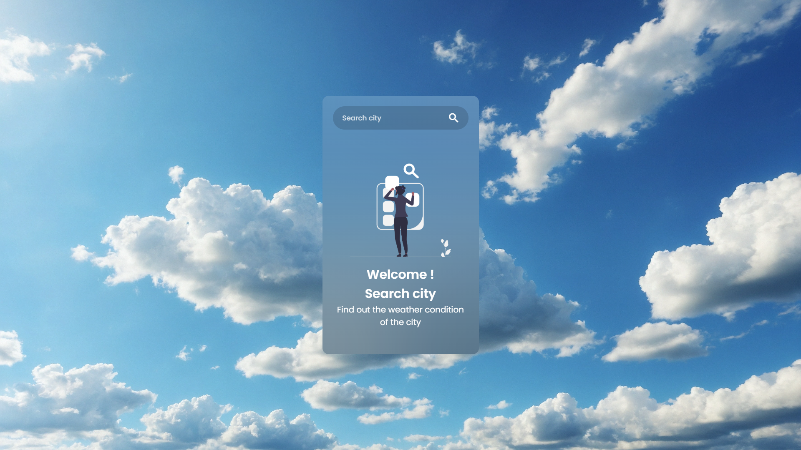
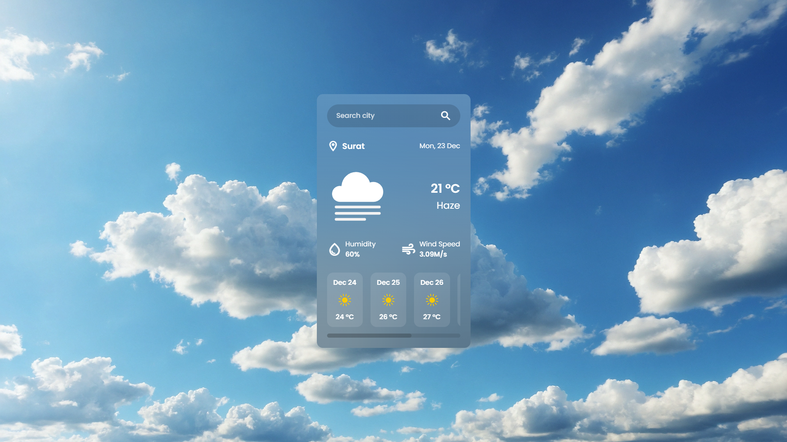

# Weather Application 🌦️  

## Task Description  
This Weather Application allows users to check real-time weather conditions and forecasts for any specified location.

## Key Features  
- Welcoming message and brief description of the app's functionality.  
- Search bar for users to input and search for weather details by location.  
- Real-time weather data fetched via the OpenWeatherMap API.  
- Display of key weather details:  
  - **Temperature**  
  - **Humidity**  
  - **Wind Speed**  
  - **Brief Description of Conditions**  

## Screenshots  
  
*Home Screen with Search Bar and Welcoming Message*  

  
*Weather Details Display for a Searched Location*  
